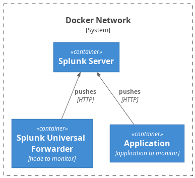

## Splunk Universal Forwarder

### Architektur



### Ausführen der `docker-compose.yml`

1. Mit dem Terminal in den Pfad navigieren, wo die `docker-compose.yml` für das Projekt sich befindet
2. `docker-compose up` ausführen und somit die Images pullen und die jeweiligen Container starten
3. Mit `docker ps` schauen, bis `healthy` zu sehen ist

### Credentials

**Splunk:**
- username: admin
- password: Test1234!

**Splunk Universal Forwarder:**
- username admin
- password: Test1234!

### Öffnen der Splunk-Web-Instanz

1. Browser der Wahl öffnen
2. In die Adresszeile `localhost:8000` eingeben
3. Mit den oben genannten Credentials einwählen

### Einrichten des Splunk Universal Forwarders

1. Container über den Status abfragen via 
   ```bash
   docker exec -it -u splunk uf /bin/bash -c "/opt/splunkforwarder/bin/splunk status"
   ```
	Sollte folgendes erscheinen:
	```bash
Warning: Attempting to revert the SPLUNK_HOME ownership
Warning: Executing "chown -R splunk /opt/splunkforwarder"
execvp: No such file or directory
Do you agree with this license? [y/n]:
	```
	mit `y` bestätigen und anschließend mit `y` das Preview ablehen und abwarten.
	Ist der Prozess fertig, den Dockerbefehl von oben noch mal nutzen, um den Status abzufragen.
2. Sollte folgende Meldung erscheinen:
   ```bash
Warning: Attempting to revert the SPLUNK_HOME ownership
Warning: Executing "chown -R splunk /opt/splunkforwarder"
splunkd is not running.
   ```
	Kann folgender Befehl ausgeführt werden:
	```bash
docker exec -it -u splunk uf /bin/bash -c "/opt/splunkforwarder/bin/splunk start"
	```
	Anschließend sollte nach der Statusabfrage folgendes stehen:
	```bash
Warning: Attempting to revert the SPLUNK_HOME ownership
Warning: Executing "chown -R splunk /opt/splunkforwarder"
splunkd is running (PID: 1271).
splunk helpers are running (PIDs: 1272).
	```
3. Über den Befehl
	```bash
docker exec -it -u splunk uf /bin/bash -c "/opt/splunkforwarder/bin/splunk help"
	```
	Kann man sich eine Übersicht über die möglichen Befehle und Subbefehle machen.

### Verbinden des Splunk Universal Forwarders mit einer Splunkinstanz

Hier für gibt es von Splunk schon einiges an [Dokumentation](https://docs.splunk.com/Documentation/Forwarder/latest/Forwarder/Configuretheuniversalforwarder). Jedoch ist bei den Docker-Containern das wichtige schreibgeschützt, sodass die Veränderung der notwendigen Dateien (`inputs.conf`, `outputs.conf` und `server.conf`) innerhalb der Container nicht möglich ist. Hierbei müssen wir uns auf die vorhandenen CLI Befehle stützen.

1. Finde mit `ifconfig` (Linux) oder `ipconfig` (Windows) heraus, welche IP-Adresse dein Computer hat
2. Füge einen Server mit folgendem Befehl zu
	```bash
docker exec -it -u splunk uf /bin/bash -c "/opt/splunkforwarder/bin/splunk add forward-server <ip>:9997"
	```
3. Starte anschließend den Container neu mit 
	- `docker stop uf`
	- `docker start uf`

### Füge Daten in die Directory hinzu

Für den Splunk-Universal-Forwarder-Container ist eine Directory, die wir über einen Ordner manipulieren können.

1. Füge in den `logs`-Ordner eine neue Datei mit einem neuen Inhalt hinzu
2. Navigiere in deinen Browser zu `localhost:8000` und melde dich an
3. Füge in die Suche folgendes ein: `index="*"`

Hiermit sollte jetzt dein Eintrag sichtbar sein.